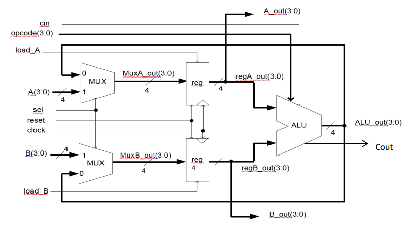

# Simple Processor

This is a Simple Processor with Structural Approach designed in VHDL. This code was implemented in Xilinx software.

Used components:

1. Multiplexer: 

	For the multiplexer were implemented two inputs with four bits each, A and B, and a one bit input ‘sel’ for selection of the signal that will be on the four bits output ‘O’. For the code was used a WHEN/ELSE approach. So when the selector is ‘0’ the output value will be A and when the selector is ‘1’ the output value will be B. 
	
	Since the input ‘sel’ is an STD_LOGIC data type is important to describe a situation if ‘sel’ receive values that are not ‘1’ or ‘0’, that is why in this design, after the second WHEN/ELSE statement was written “0000”, so the output of the mux will be “0000” when this situation happens.

2. Register (D Flip Flop): 

	The register was implemented considering a four bits data input, which will be passed to the output when the enable input bit is ‘1’ and happens a rising edge in the clock. There is also a reset input to put “0000” in the register output. 
	
	A process was described with four parameters in the sensitivity list: reset (rst), clock (clk), enable (en) and data input (Data_in). An if was inserted to check if the rst is one if it happens to be the output will be “0000”, else the code will check for a clock alteration and if it was also a rising edge. If the rising edge happens the register will check if the enable is ‘1’, if it is the output will be updated with the input value, otherwise the output will remain the same that was previous.

3. Arithmetic Logic Unit (ALU)

	This ALU consists in the sixteen operations shown in the Table 1. A and B are the data inputs with four bits each. The opcode tells which operation the ALU will do. The output will be the result of the operation in a four bits STD_LOGIC_VECTOR plus a one bit STD_LOGIC to represent the carry out when possible.

	The code implementation of the ALU consisted in checking the opcode value and redirecting to the proper operation. The programming resource used was the CASE. So when the opcode has determined value the correct operation is executed using the data inputs A and B.

	The eight first operation are logic. The “0000” and “0001” operations make the one’s complement of A and B inputs, respectively. The “0010” and “0011” makes an AND and OR operation between the A and B inputs, respectively. And for the other operations “0100”, “0101”, “0110” and “0111” are NAND, NOR, XOR and XNOR between A and B, respectively.All this logic operations are send directly to the ALU four bits output and Cout will always be ‘0’;
	
	The last eight operations are arithmetic. The “1000” and “1011” operations transfer the A and B to the output, respectively, being the Cout ‘0’. The “1001” and “1100” operations increments the A and B, respectively, in this case Cout is used and the method applied will be described below. The “1010” and the “1101” operations decrements A and B, respectively, no carry out is applied for this operations. The operation “1110” add unsigned A and unsigned B, in this case the carry out is applied. The last operation “1111” execute a subtraction between signed A and signed B, and the carry out is not used. To calculate the carry out a five bits STD_LOGIC_VECTOR was declared to store the result of the operations that use the carry out. In this operation the most significant bit is the Cout output and the other four least significant are the ALU output (ALU_out).
	
4. Simple Processor

	For the processor all the components previously described were put together and connect with the proper signals. The processor contains two multiplexer, two registers and one ALU.

	In the first multiplexer was inserted in the ALU output and the A data input. In the second the same ALU output was inserted and the B data input. The selectors of the multiplexers were connected into the same ‘sel’ input.
	
	The data inputs of the registers are the outputs of the multiplexers. To load the data input in a register a load input was necessary to be declared, so for each of the register there is a load input connected to the enable input of the register component. Another input necessary to load the register is the clock, once a rising edge happens the output receives the data input if the load is active. The last input of the register is the reset, responsible for putting “0000” in the register output. The resets are connected together.
	
	In the ALU the two data inputs are the data that come from the registers outputs, and the opcode is an input of the processor entity. Given the proper inputs the result obtained is send to the four bit ALU output that is connected with the two multiplexers as said before. The other output is the carry out (Cout) which is set when carry out happens.

	The data outputs of the processor are the outputs of the registers, being these A_out and B_out. The third output is the Cout. Five internal signals were necessary to the implementation: two for the multiplexers data outputs (one for each), two for the registers data outputs (one for each) and one for the ALU output.

	To make an easier test bench an ALU output was inserted so the values will be more visible and less clock cycles were used.
